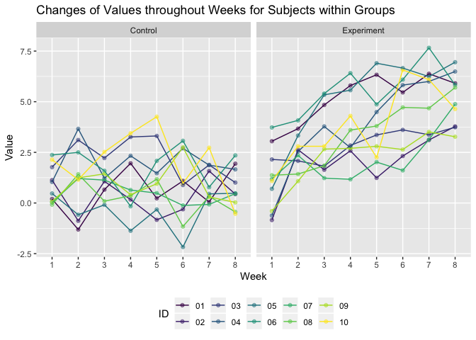

p8105\_hw5\_sl4655
================
Shuya Liu
November 9, 2019

Problem 1
---------

``` r
set.seed(10)

## Set missing values
iris_with_missing = iris %>% 
  map_df(~replace(.x, sample(1:150, 20), NA)) %>%
  mutate(Species = as.character(Species))
```

#### Define Function

-   For numeric variables, you should fill in missing values with the mean of non-missing values
-   For character variables, you should fill in missing values with "virginica"

Write a function that takes a vector as an argument; replaces missing values using the rules defined above; and returns the resulting vector. Apply this function to the columns of iris\_with\_missing using a map statement.

``` r
## Define function
fill_na <- function(x){
  ## Check for argument
  if (!is.numeric(x) & !is.character(x)) { ## for variables that are not numeric and variables
    stop("Argument x must be numeric or character.")
  }else if (length(x) == 1) { ## vector with length 1
    stop("Cannot be computed for length 1 vectors")
  }
  
  ## Replace NA
  if (is.numeric(x)) { ## for numeric variables
    replace_na(x, round(mean(x, na.rm = TRUE), digits = 1))
  }else{ ## for character variables
    replace_na(x, "virginica")
  }
}

## Replace missing values in iris_with_missing
iris_no_missing <- map_dfr(iris_with_missing, fill_na)
```

Problem 2
---------

#### Create a tidy dataframe

-   Start with a dataframe containing all file names; the list.files function will help
-   Iterate over file names and read in data for each subject using purrr::map and saving the result as a new variable in the dataframe
-   Tidy the result; manipulate file names to include control arm and subject ID, make sure weekly observations are “tidy”, and do any other tidying that’s necessary

Make a spaghetti plot showing observations on each subject over time, and comment on differences between groups.

``` r
## create dataset
df_study <- tibble(name_file = list.files(path = "./data")) %>% ## read files' names
  mutate(name_path = paste("./data/", name_file, sep = ""), ## create files' paths
         data_study = map(name_path, ~read.csv(.x))) %>% ## read files
  unnest(cols = data_study) %>%
  separate(data = ., col = name_file, into = c("arm", "id","type")) %>%
  select(-c(type, name_path)) %>%
  pivot_longer(cols = week_1:week_8,
               names_to = "week",
               names_prefix = "week_",
               values_to = "value") %>%
  mutate(arm = factor(arm, levels = c("con", "exp"), labels = c("Control", "Experiment")),
         id = as.factor(id),
         week = as.factor(week))

## Create spaghetti plot
ggplot(data = df_study, mapping = aes(x = week, y = value, color = id, group = id)) + 
  geom_point(alpha = .5) +
  geom_line() +
  facet_grid( ~ arm) +
  labs(
    title = "Changes of Values throughout Weeks for Subjects within Groups",
    x = "Week",
    y = "Value"
  ) + 
  viridis::scale_color_viridis(
    name = "ID", 
    discrete = TRUE
  ) + 
  theme(legend.position = "bottom")
```



#### Comments

According to the figure above, there are relatively no changes for eight weeks among subjects in the control arm. Yet, there is an obvious increase for every subject from week one to week eight in the experiment arm.

Problem3
--------

#### Set design elements:

-   Fix n=30
-   Fix xi1 as draws from a standard Normal distribution
-   Fix β0=2
-   Fix σ2=50

``` r
sim_regression = function(beta1, beta0 = 2, n = 30, sigma2 = 50) {
  
  ## set sim data with regression model
  sim_data = tibble(
    x = rnorm(n, mean = 0, sd = 1),
    y = beta0 + beta1 * x + rnorm(n, 0, sqrt(sigma2))
  )
  
  ## linear regression model for the data
  ls_fit = lm(y ~ x, data = sim_data)
  ls_stat = broom::tidy(ls_fit, conf.level = 0.95)
  
  ## statistics for the model
  tibble(
    beta1_true = beta1,
    beta1_hat = ls_stat$estimate[2],
    p_value = ls_stat$p.value[2]
  )
}
```

#### Set β1=0. Generate 10000 datasets from the model
